# 集客消費回饋平台 功能規格文件

**專案名稱**：集客消費回饋平台
**文件版本**：v1.0
**最後更新**：2025-10-16
**平台**：iOS & Android App + Web 後台管理系統

---

## 目錄

1. [專案概述](#專案概述)
2. [核心功能模組](#核心功能模組)
   - [點數分潤系統](#1-點數分潤系統)
   - [商品瀏覽與訂購](#2-商品瀏覽與訂購)
   - [購物車系統](#3-購物車系統)
   - [訂單交易管理](#4-訂單交易管理)
   - [推薦系統](#5-推薦系統)
   - [會員系統](#6-會員系統)
   - [商家資訊](#7-商家資訊)
   - [公告通知系統](#8-公告通知系統)
3. [開發時程](#開發時程)

---

## 專案概述

本專案為一個整合消費分潤機制的訂餐與消費回饋平台，主要特色包括：

- **消費分潤機制**：用戶消費可獲得回饋金，商家可獲取分潤點數
- **推薦獎勵系統**：用戶推薦新會員可獲得獎勵
- **多元訂購方式**：支援即時訂單與預約訂單
- **公益回饋**：整合公益基金捐贈功能
- **商家營運分析**：提供完整的營收統計和數據分析

---

## 核心功能模組

### 1. 點數分潤系統

**功能說明**：
點數分潤系統是本平台的核心功能，讓消費者和商家都能從交易中獲得回饋。用戶可以查看回饋金收入、營收統計、點數記錄等資訊。

**包含頁面**：21 個設計畫面

---

#### 1.1 回饋金收入明細

**功能描述**：
- 顯示用戶的回饋金收入列表
- 包含日期、回饋金類別、訂單編號、收益金額等資訊
- 提供本月回饋金收益總額統計
- 支援按時間篩選和查詢

**設計圖示例**：

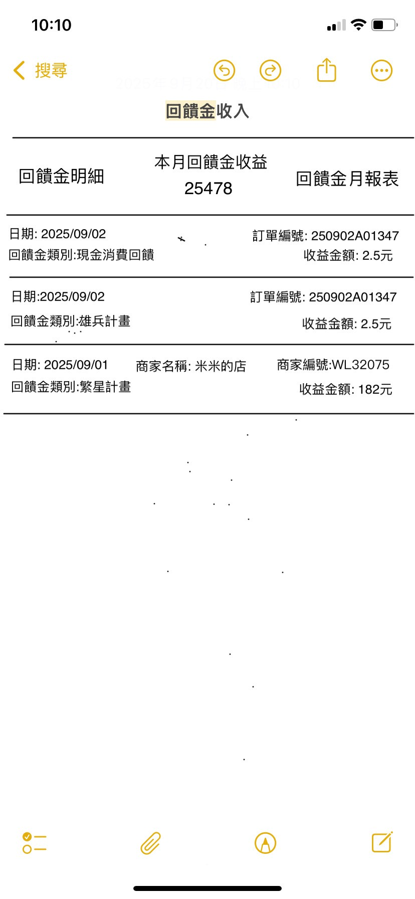

**技術需求**：
- 需整合交易系統API取得回饋金資料
- 支援即時更新
- 提供CSV報表匯出功能

---

#### 1.2 營收統計報表

**功能描述**：
- 提供每日、每月、每年的營收統計
- 視覺化圖表展示營收趨勢
- 支援多維度數據分析
- 商家專用功能

**設計圖示例**：

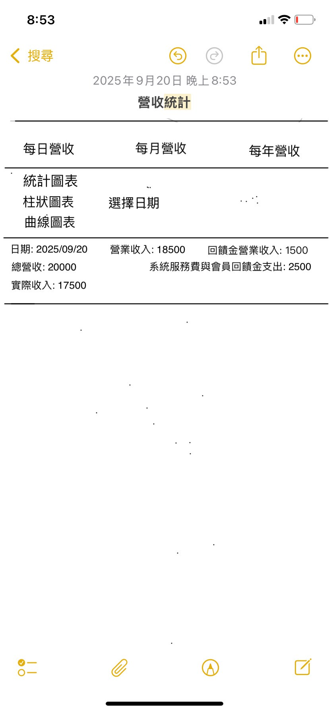

**技術需求**：
- 圖表庫整合（建議使用 Chart.js 或類似庫）
- 資料快取機制提升載入速度
- 支援日期區間選擇

---

#### 1.3 點數記錄與交易紀錄

**功能描述**：
- 顯示永久點數和限時點數餘額
- 詳細的點數變動記錄
- 關聯交易訂單資訊
- 點數有效期提醒

**設計圖示例**：

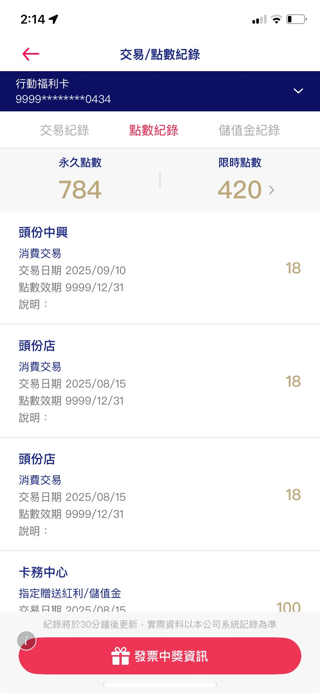

---

#### 1.4 營運分析選單

**功能描述**：
- 商家營運分析功能入口
- 提供各種統計分析工具
- 快速導航到不同報表

**設計圖示例**：

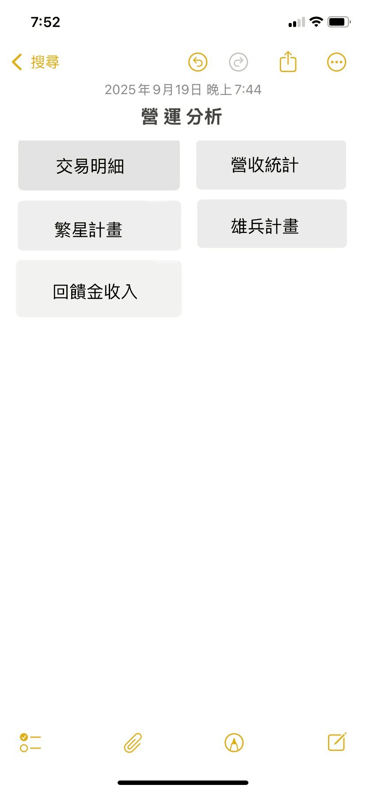

---

#### 1.5 其他分潤相關功能

**回饋與獎勵選單**：

**回饋請求單**：

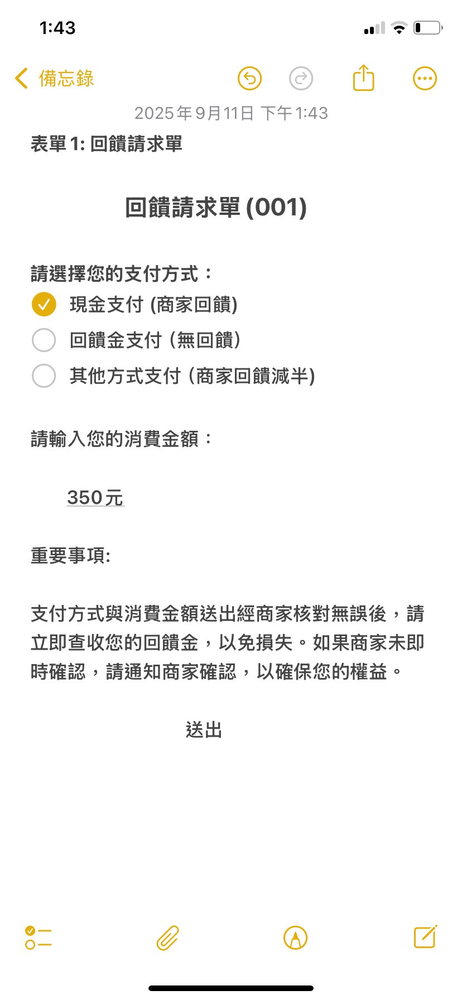

**公益回饋頁面**：

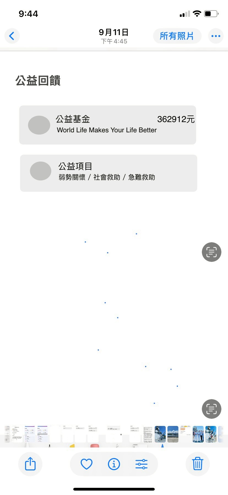

**回饋金月報表**：

**平台商城-積分兌換**：

---

### 2. 商品瀏覽與訂購

**功能說明**：
提供完整的商品瀏覽、搜尋、分類和自訂功能，讓用戶可以輕鬆找到想要的商品並進行訂購。

**包含頁面**：9 個設計畫面

---

#### 2.1 商品列表

**功能描述**：
- 依商品分類顯示（套餐、河粉、麵食、精緻餐點等）
- 顯示商品圖片、名稱、價格、原價
- 特價標籤和人氣精選標示
- 支援商品快速加入購物車

**設計圖示例**：

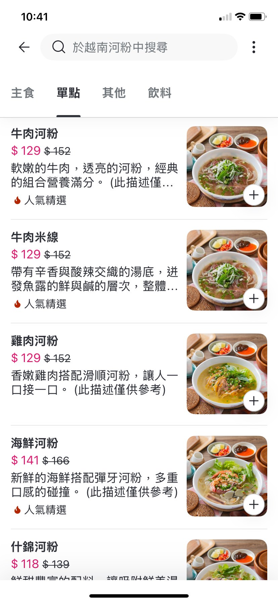

**技術需求**：
- 商品分類系統
- 圖片延遲載入優化
- 商品搜尋與篩選功能

---

#### 2.2 商品詳情頁

**功能描述**：
- 完整的商品資訊（圖片、名稱、價格、說明）
- 商品自訂選項選擇（容量、配料、辣度等）
- 數量調整
- 加入購物車功能
- 商品營養資訊和熱量標示

**設計圖示例**：

---

#### 2.3 商品自訂選項

**功能描述**：
- 支援多種自訂選項（容量、升級瓶裝等）
- 選項價格加成顯示
- 必填項目標示
- 人氣精選標記

**設計圖示例**：

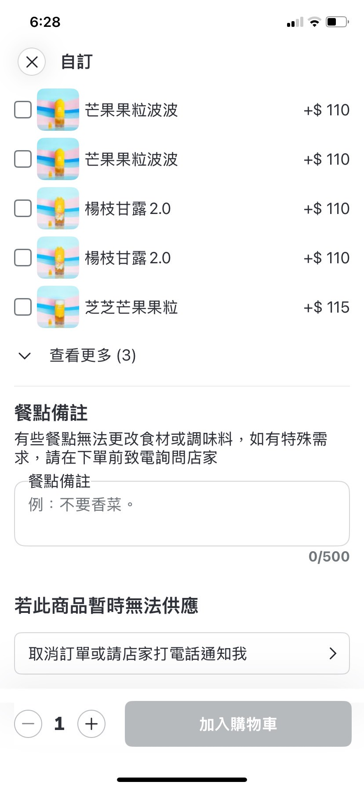

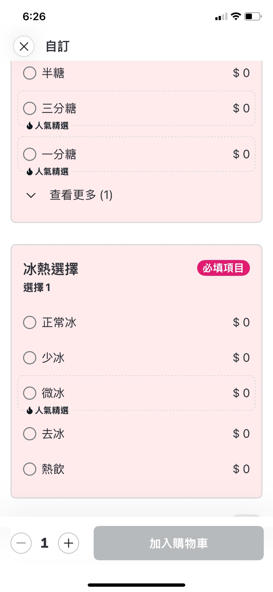

**技術需求**：
- 動態價格計算
- 選項組合驗證
- 購物車資料結構設計

---

### 3. 購物車系統

**功能說明**：
完整的購物車功能，支援商品管理、數量調整、公益基金捐贈等功能。

**包含頁面**：7 個設計畫面

---

#### 3.1 購物車頁面

**功能描述**：
- 顯示已加入的商品列表
- 商品圖片、名稱、規格、數量、價格
- 支援商品數量調整和刪除
- 顯示總金額計算
- 繼續加點功能
- 三步驟購物流程指示（菜單 → 購物車 → 結帳）

**設計圖示例**：

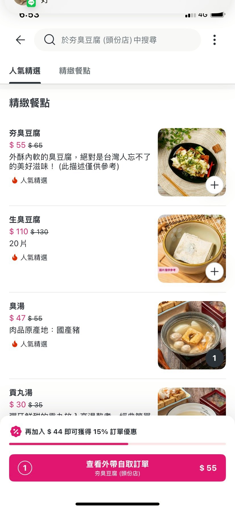

**技術需求**：
- 購物車狀態管理
- 即時價格計算
- 商品庫存檢查

---

#### 3.2 購物車-公益基金捐贈

**功能描述**：
- 整合公益基金捐贈選項
- 用戶可選擇是否捐贈
- 顯示公益基金資訊
- 捐贈金額計入訂單總額

**設計圖示例**：

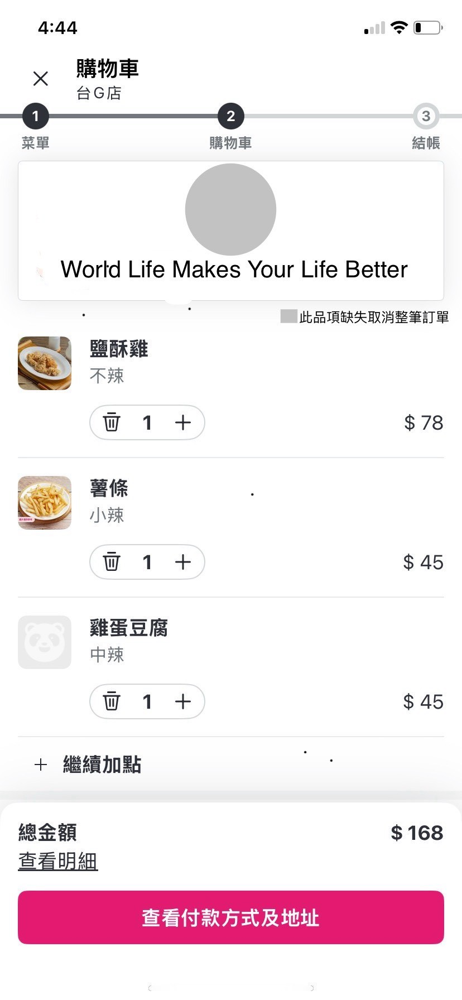

**技術需求**：
- 公益基金模組整合
- 捐贈記錄追蹤
- 稅務相關處理（如需要）

---

### 4. 訂單交易管理

**功能說明**：
完整的訂單管理系統，包含即時訂單、預約訂單、訂單狀態追蹤等功能。

**包含頁面**：5 個設計畫面

---

#### 4.1 訂單列表

**功能描述**：
- 多種訂單狀態分類：
  - 待回饋訂單
  - 預訂待確認
  - 歷史交易記錄
- 訂單基本資訊顯示
- 訂單狀態標示
- 快速操作按鈕

**設計圖示例**：

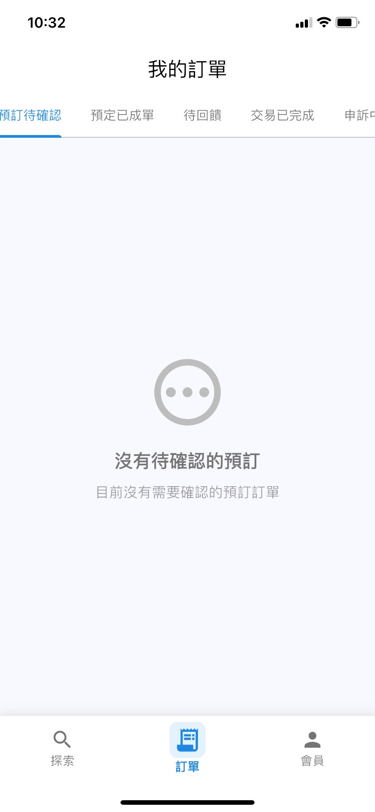

**技術需求**：
- 訂單狀態機制
- 即時通知推送
- 訂單篩選和搜尋

---

#### 4.2 訂單明細

**功能描述**：
- 完整的訂單詳細資訊
- 商品列表與金額明細
- 訂單狀態時間軸
- 取消/修改訂單功能（視狀態而定）

**設計圖示例（含開發標註）**：

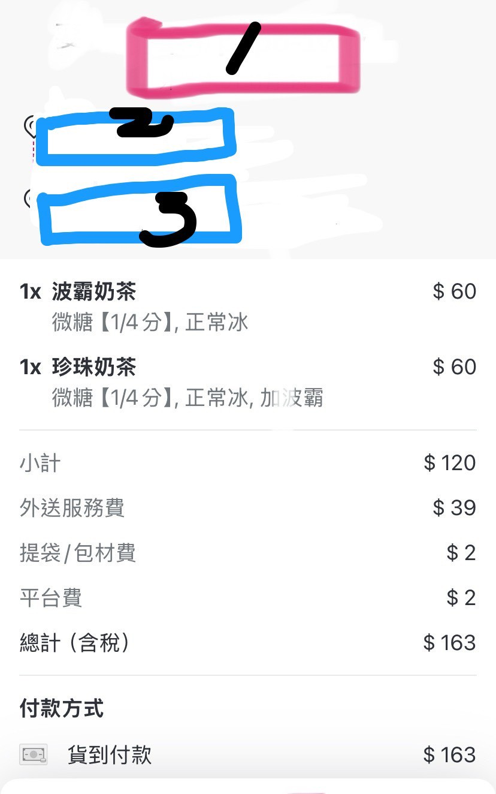

**技術需求**：
- 訂單詳情API
- 訂單操作權限控制
- 支付狀態同步

---

### 5. 推薦系統

**功能說明**：
完整的推薦獎勵機制，用戶可以推薦新會員加入並獲得獎勵。

**包含頁面**：4 個設計畫面

---

#### 5.1 推薦碼功能

**功能描述**：
- 推薦碼輸入介面
- 支援手動輸入或掃描QR code
- 推薦碼驗證
- 推薦碼生成中的載入狀態
- 推薦成功提示

**設計圖示例**：

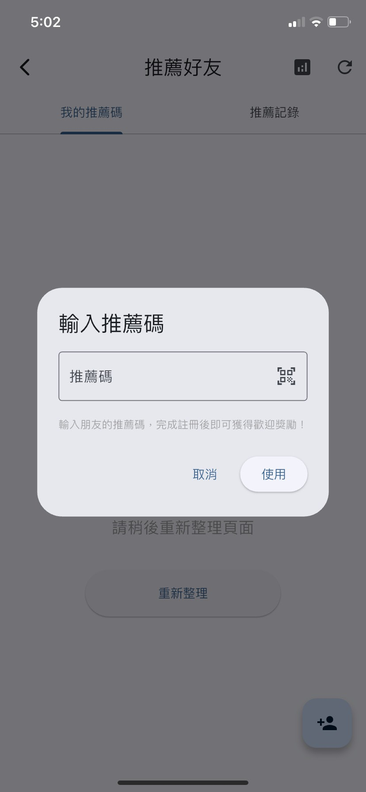

**技術需求**：
- QR code 掃描功能
- 推薦碼生成演算法
- 推薦關係記錄

---

#### 5.2 推薦記錄與計畫

**功能描述**：
- 推薦好友記錄列表
- 推薦獎勵統計
- 特殊推薦計畫（如雄兵計畫）

**設計圖示例**：

**技術需求**：
- 推薦層級追蹤
- 獎勵計算引擎
- 推薦成效統計

---

### 6. 會員系統

**功能說明**：
完整的會員功能，包含會員中心、推薦獎勵、商家專屬功能等。

**包含頁面**：6 個設計畫面

---

#### 6.1 會員中心首頁

**功能描述**：
- 會員基本資訊顯示
- 功能快速入口
- 點數餘額顯示
- 會員等級資訊

**設計圖示例**：

**技術需求**：
- 會員資料管理
- 會員等級系統
- 個人資料編輯功能

---

#### 6.2 會員中心-推薦獎勵

**功能描述**：
- 推薦獎勵詳細資訊
- 推薦碼分享功能
- 推薦獎勵記錄
- 我的推薦碼展示

**設計圖示例**：

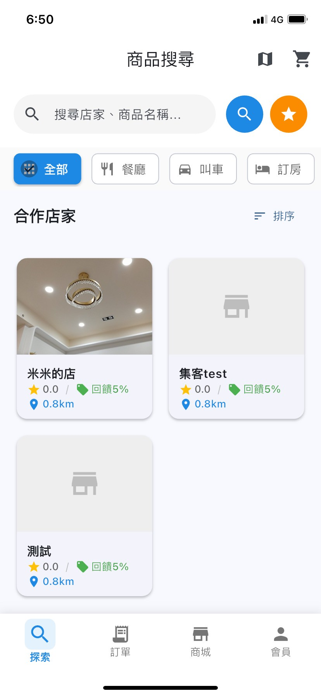

---

#### 6.3 會員中心-商家功能

**功能描述**：
- 商家會員專屬功能入口
- 商家管理工具
- 營運數據快速查看

**設計圖示例**：

**技術需求**：
- 角色權限管理（普通用戶/商家用戶）
- 商家功能模組

---

### 7. 商家資訊

**功能說明**：
商家詳細資訊展示，包含商家介紹、地址、營業時間、評分等。

**包含頁面**：3 個設計畫面

---

#### 7.1 商家詳情頁

**功能描述**：
- 商家基本資訊
- 商家地址與地圖
- 營業時間
- 商家評分
- 商家簡介
- 商品分類導航

**設計圖示例**：

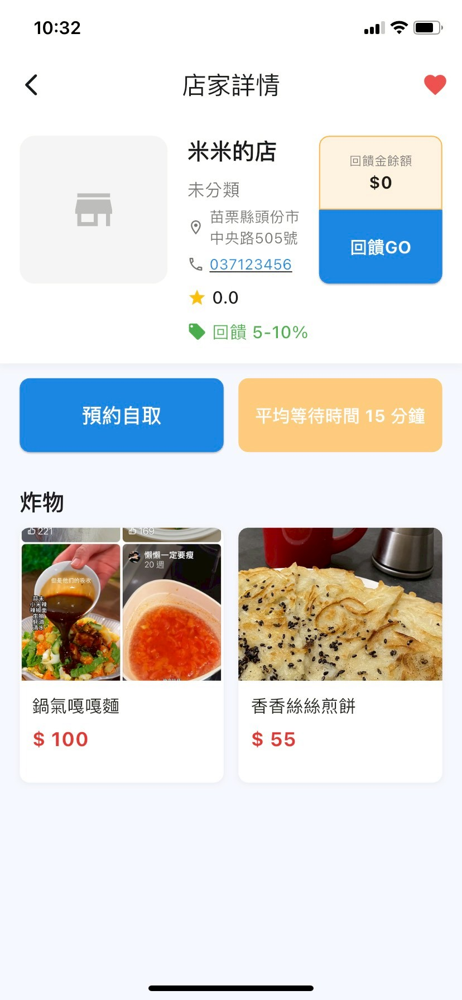

**設計圖示例（含開發標註）**：

**技術需求**：
- Google Maps API 整合
- 商家資料管理系統
- 距離計算功能

---

### 8. 公告通知系統

**功能說明**：
系統公告、操作須知、規則說明等資訊展示。

**包含頁面**：7 個設計畫面

---

#### 8.1 外帶自取訂單通知

**功能描述**：
- 外帶自取訂單提示
- 訂單編號顯示
- 取餐地點檢查提醒

**設計圖示例**：

---

#### 8.2 預訂自取須知

**功能描述**：
- 預訂自取流程說明
- 注意事項提醒
- 使用規則說明

**設計圖示例**：

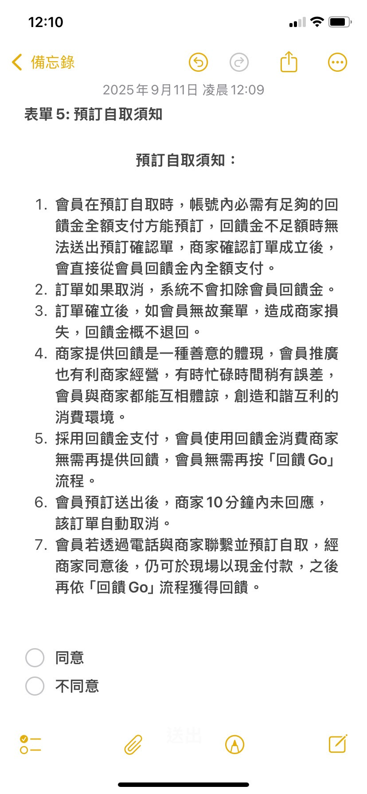

---

#### 8.3 商家營業時間說明

**功能描述**：
- 商家營業時間公告
- 特殊營業時間提醒

**設計圖示例**：

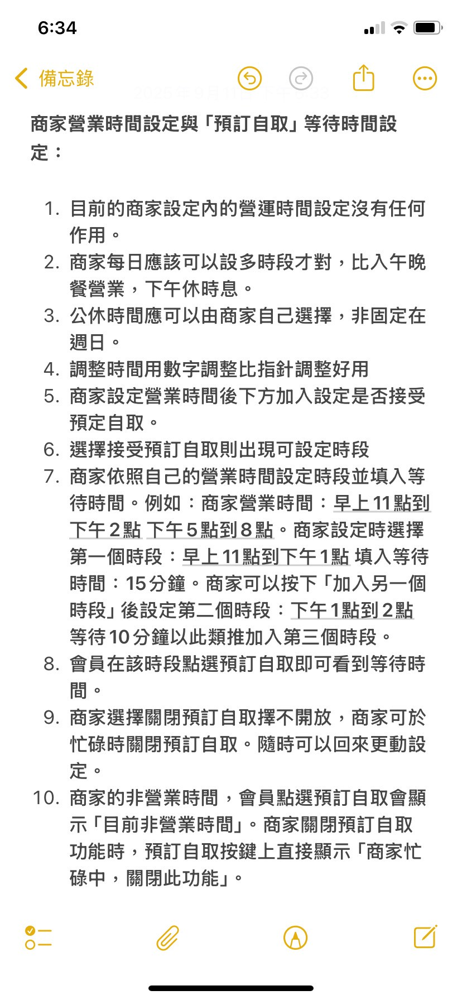

---

#### 8.4 商品上架事宜說明

**功能描述**：
- 商品上架規則說明
- 商家端上架注意事項

**設計圖示例**：

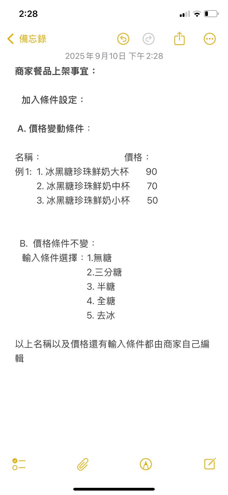

**技術需求**：
- 公告管理系統
- 推播通知功能
- 富文本編輯器

---

### 9. 其他 UI 元件

#### 9.1 數量選擇器

**功能描述**：
- 商品數量調整元件
- 加減按鈕
- 數量輸入

**設計圖示例**：

---

## 開發時程

### 階段一：需求討論與設計（2025/10/15 ~ 11/30）

**工作內容**：
- 需求討論與釐清
- 功能使用流程繪製
- Wireframe 交付
- 視覺設計確認

**交付物**：
- 功能規格文件
- 使用流程圖
- UI/UX 設計稿

---

### 階段二：Alpha 測試版開發（2025/12/31 前）

**工作內容**：
- iOS App Alpha 版本開發
- Web 後台管理系統開發
- TestFlight 部署

**交付物**：
- iOS App Alpha 測試版（TestFlight）
- Web 後台管理系統

**注意事項**：
- Apple Store 上架需申請鄧白氏認證
- TestFlight 需依 Apple 官方指引安裝
- Android App 功能比照 iOS 開發

---

### 階段三：功能與樣式調整（2026/1/31）

**工作內容**：
- 根據 Alpha 測試回饋調整
- 核心功能優化
- UI/UX 樣式微調

**交付物**：
- 功能調整報告
- 優化後的測試版本

---

### 階段四：Beta 測試發布（2026/2/10）

**工作內容**：
- App Store & Google Play Beta 測試發布
- 外部測試用戶招募
- 功能微調

**交付物**：
- iOS App Beta 版（App Store）
- Android App Beta 版（Google Play）

**注意事項**：
- Google Play 需 14 個不同帳戶測試用戶，測試 14 天後可通過審核
- Beta 測試人員由客戶方提供

---

### 階段五：正式上架（2026/3/1）

**工作內容**：
- App Store / Google Play 審查通過
- 正式版本發布

**交付物**：
- 正式上架的 App
- 上架文件與資料

---

### 階段六：市場測試（2026/3/1 ~ 4/30）

**工作內容**：
- 市場推廣測試
- 維護既有功能
- 不新增功能

**交付物**：
- 維護報告
- 使用數據分析

**注意事項**：
- 此階段僅維護，不新增功能
- 測試完成後正式結案交付

---

## 技術架構建議

### 前端技術
- **App 開發**：React Native / Flutter（建議）
- **Web 後台**：React.js / Vue.js
- **UI 框架**：Material-UI / Ant Design

### 後端技術
- **API 服務**：Node.js / Python (Django/Flask)
- **資料庫**：PostgreSQL / MySQL
- **快取**：Redis
- **檔案儲存**：AWS S3 / Google Cloud Storage

### 第三方服務
- **地圖服務**：Google Maps API
- **推播通知**：Firebase Cloud Messaging
- **支付整合**：（待確認支付方式）
- **簡訊驗證**：（待確認簡訊服務商）

---

## 待討論事項

以下項目需要進一步討論確認：

### 1. 消費分潤制度細節
- 商家分潤比例設定
- 消費者等級累積規則
- 點數有效期規則

### 2. 會員等級系統
- 各會員等級權限設定
- 各會員等級資格設定
- 會員等級升降機制

### 3. 簡易菜單系統（商家端）
- 菜單管理功能範圍
- 商品上架流程
- 庫存管理方式

### 4. 支付方式
- 支援的支付方式（信用卡、行動支付等）
- 支付串接服務商選擇
- 點數折抵規則

### 5. 通知機制
- 推播通知觸發時機
- Email 通知範圍
- 簡訊通知使用場景

---

## 功能統計摘要

| 功能模組 | 設計圖數量 | 佔比 |
|---------|----------|------|
| 點數分潤系統 | 21 張 | 35.6% |
| 商品瀏覽與訂購 | 9 張 | 15.3% |
| 購物車系統 | 7 張 | 11.9% |
| 公告通知系統 | 7 張 | 11.9% |
| 會員系統 | 6 張 | 10.2% |
| 訂單交易管理 | 5 張 | 8.5% |
| 推薦系統 | 4 張 | 6.8% |
| 商家資訊 | 3 張 | 5.1% |
| 其他 UI 元件 | 1 張 | 1.7% |
| **總計** | **59 張** | **100%** |

---

## 文件版本記錄

| 版本 | 日期 | 修改內容 | 修改人 |
|------|------|----------|--------|
| v1.0 | 2025-10-16 | 初始版本建立，包含所有功能模組說明及設計圖 | Claude Code |

---

**文件結束**
